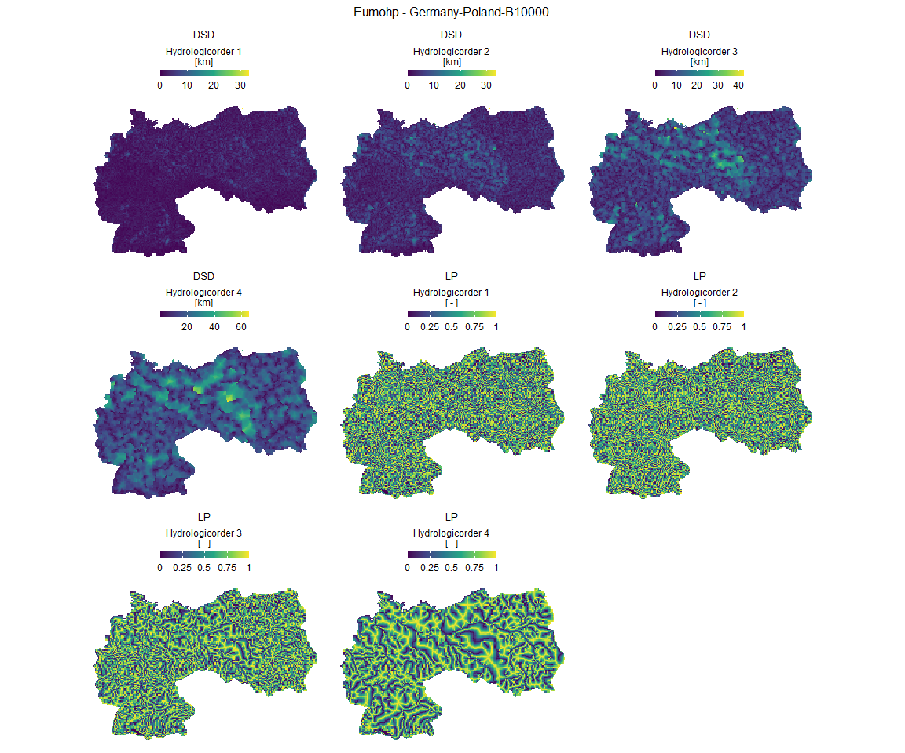

<!-- README.md is generated from README.Rmd. Please edit that file -->

# eumohpclipr 

<!-- badges: start -->

[](https://lifecycle.r-lib.org/articles/stages.html#experimental)
[](https://github.com/MxNl/eumohpclipr/actions)
[](https://www.repostatus.org/#active)
[](https://cran.r-project.org/web/licenses/MIT%20+%20file%20LICENSE)
[](https://app.codecov.io/gh/MxNl/eumohpclipr?branch=main)
<!-- badges: end -->

The goal of eumohpclipr is to provide users of the EU-MOHP data set with
the functionality to

1.  **eumohp_clip()**: Clip the raster .tif files to their custom area
    of interest and define a required subset of the data.
2.  **eumohp_plot()**: Plot the clipped and subsetted data relatively
    fast though using stars proxy objects.
3.  **eumohp_write()**: To write the clipped and subsetted data to disc
    as .tif files. This helps to reduce file sizes to the required
    spatial extent.

The EU-MOHP data set is meant as temporally static and spatially
contiguous environmental predictors for the application of predominantly
machine learning models for hydrologic and hydrogeological modelling /
mapping tasks. It can be used along with other environmental predictors,
such as land use and land cover data, soil maps, geological maps,
digital elevation models, etc.

## Installation

You can install the development version of eumohpclipr from
[GitHub](https://github.com/) with:

``` r
# install.packages("devtools")
devtools::install_github("MxNl/eumohpclipr")
```

## Example

### Prerequisites

In order to use this package with data, it is a necessary to download
the EU-MOHP data set from the data hosting platform
[hydroshare](https://www.hydroshare.org/) in the latest or required
version. After the dowload the zipped .7z files must be unzipped and
stored in the same directory.

### Load the package

``` r
library(here)
#> here() starts at D:/Data/github/eumohpclipr
library(eumohpclipr)
```

### Clipping and Subsetting

Get the directory, where the EU-MOHP Geotiffs (.tif) files are stored.

``` r
eumohp_directory <- here::here(
  "..",
  "macro_mohp_feature_test",
  "macro_mohp_feature",
  "output_data"
)
```

This directory contains all the unzipped downloaded files as described
previously on my local computer. This directory needs to be changed
according to the directory on your local machine.

Specifying the spatial extent of the clipped result via the argument:
`countries`

``` r
eumohp_clipped_countries <- eumohp_clip(
  directory_input = eumohp_directory,
  countries = c("germany", "poland"),
  buffer = 1E4,
  hydrologic_order = 1:4,
  abbreviation_measure = c("dsd", "lp"),
  eumohp_version = "v013.1.1"
)
```

The resulting `eumohp_clipped` object holds a list of clipped and
subsetted stars proxy objects. This list can later be fed into the
functions `eumohp_plot` or `eumohp_write`.

We can have a look at the length of the list `eumohp_clipped_countries`.

``` r
eumohp_clipped_countries |> length()
#> [1] 8
```

In this case, `eumohp_clipped_countries` contains 8 stars proxy objects
because we requested 4 hydrologic orders (`hydrologic_order = 1:4`) and
2 measures (`abbreviation_measure = c("dsd", "lp")`). 2 \* 4 = 8.

But there are also other options to specify the area of interest.
Specifying the spatial extent of the clipped result via the argument:
`custom_sf_polygon`

``` r
eumohp_clipped_customsfpolygon <- eumohp_clip(
  directory_input = eumohp_directory,
  custom_sf_polygon = .test_custom_sf_polygon() |> summarise(),
  buffer = 1E4,
  hydrologic_order = 1:4,
  abbreviation_measure = c("dsd", "lp"),
  eumohp_version = "v013.1.1"
)
```

Specifying the spatial extent of the clipped result via the argument:
`region_name_spatcov`

``` r
eumohp_clipped_regionnamespatcov <- eumohp_clip(
  directory_input = eumohp_directory,
  region_name_spatcov = c("france", "turkey", "italy2"),
  hydrologic_order = 1:4,
  abbreviation_measure = c("dsd", "lp"),
  eumohp_version = "v013.1.1"
)
```

Here, the argument `buffer` can not be applied as we are already using
the maximum coverage of the EU-MOHP raster files through using the files
directly for setting the spatial extent.

### Plotting

You can plot the clipped and subsetted data with `eumohp_plot()`

``` r
eumohp_clipped_countries |> 
  eumohp_plot(downsample = 200)
#> [1] "germany-poland-b10000_dsd_hydrologicorder1_30m"
#> [1] "germany-poland-b10000_dsd_hydrologicorder2_30m"
#> [1] "germany-poland-b10000_dsd_hydrologicorder3_30m"
#> [1] "germany-poland-b10000_dsd_hydrologicorder4_30m"
#> [1] "germany-poland-b10000_lp_hydrologicorder1_30m"
#> [1] "germany-poland-b10000_lp_hydrologicorder2_30m"
#> [1] "germany-poland-b10000_lp_hydrologicorder3_30m"
#> [1] "germany-poland-b10000_lp_hydrologicorder4_30m"
#> Warning: Removed 12434 rows containing missing values (geom_raster).
#> Removed 12434 rows containing missing values (geom_raster).
#> Removed 12434 rows containing missing values (geom_raster).
#> Removed 12434 rows containing missing values (geom_raster).
#> Removed 12434 rows containing missing values (geom_raster).
#> Removed 12434 rows containing missing values (geom_raster).
#> Removed 12434 rows containing missing values (geom_raster).
#> Removed 12434 rows containing missing values (geom_raster).
```

 You
don’t have to provide the `downsample` argument, as it has a default
value. But if your area of interest is quite large, a higher value for
this argument reduces the time to plot.

### Writing Results to Disk

Regarding run time and memory, writing the data is the crucial part.
This can be very expensive. This is why it is recommended to run this in
parallel mode on a computer with sufficient memory and can be shut on
for a few hours or days.

Write the data in sequential mode (not recommended)

``` r
eumohp_clipped_countries |>
  eumohp_write(directory_output = here("..", "output_test"))
```

Write the data in parallel mode (not recommended)

``` r
future::plan(future::multisession, 
             workers = ceiling(length(eumohp_clipped_countries) / 3))

eumohp_clipped_countries |>
  eumohp_write(directory_output = here("..", "output_test"),
               parallel = TRUE)
```

## Citation

``` r
citation("eumohpclipr")
#> 
#> To cite package 'eumohpclipr' in publications use:
#> 
#>   Maximilian Nölscher (2022). eumohpclipr: Clipping the EU-MOHP data
#>   set to a selected country. R package version 0.0.0.9000.
#> 
#> Ein BibTeX-Eintrag für LaTeX-Benutzer ist
#> 
#>   @Manual{,
#>     title = {eumohpclipr: Clipping the EU-MOHP data set to a selected country},
#>     author = {Maximilian Nölscher},
#>     year = {2022},
#>     note = {R package version 0.0.0.9000},
#>   }
```
